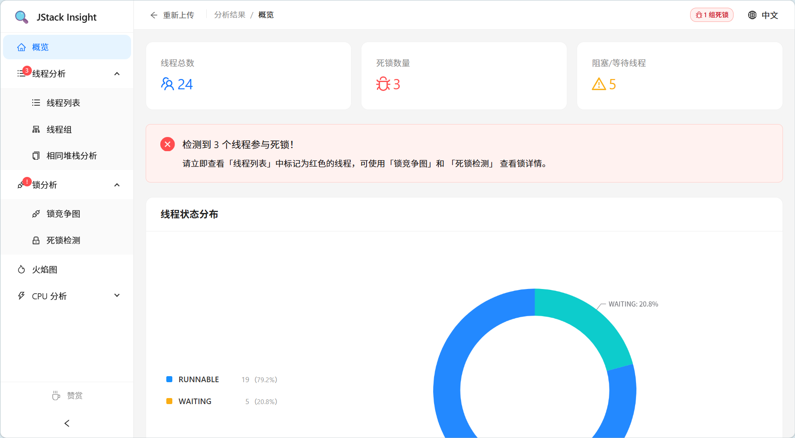
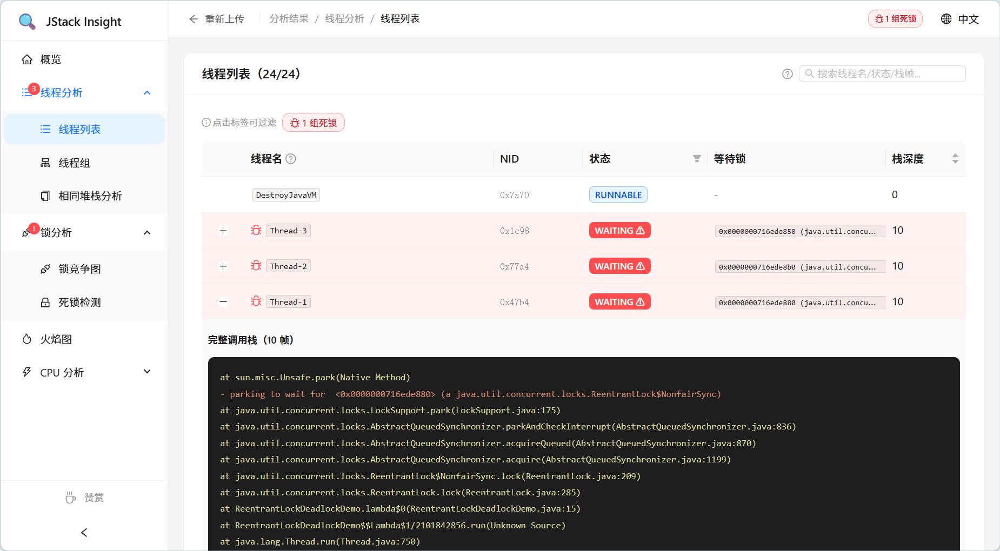
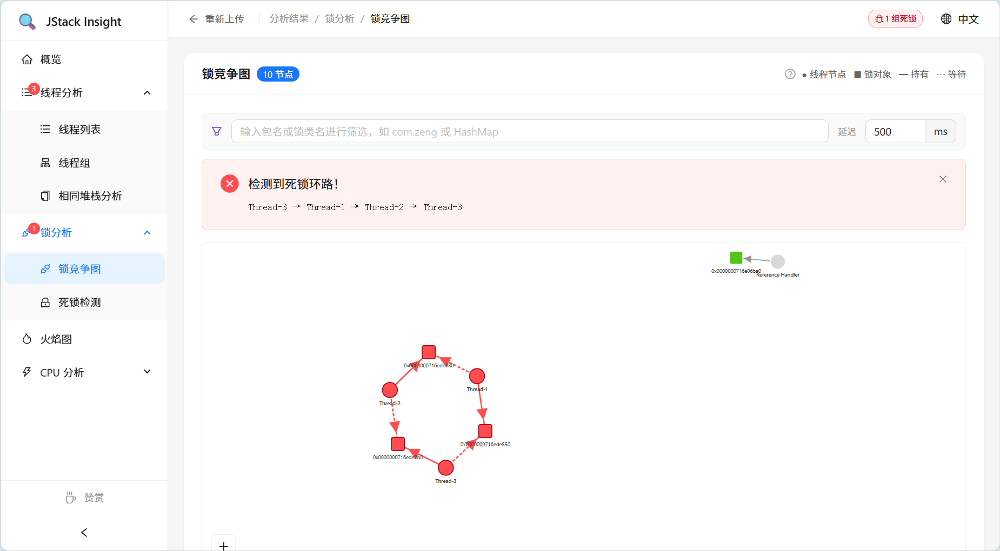
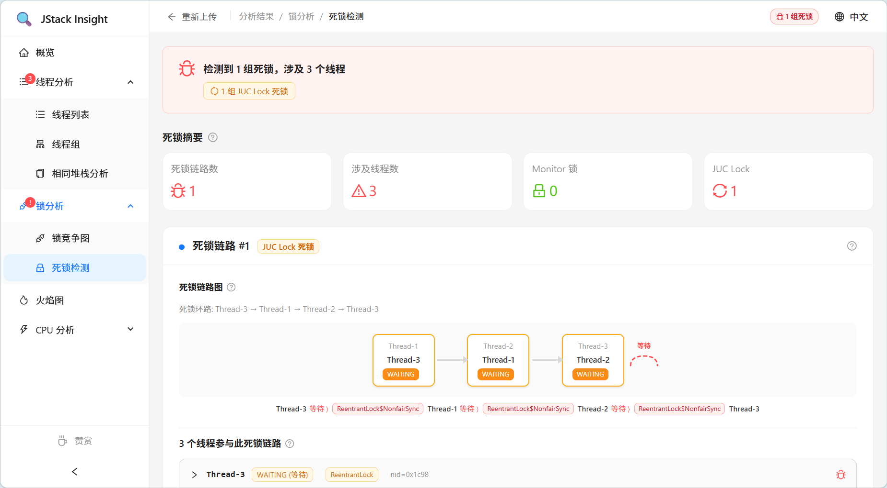
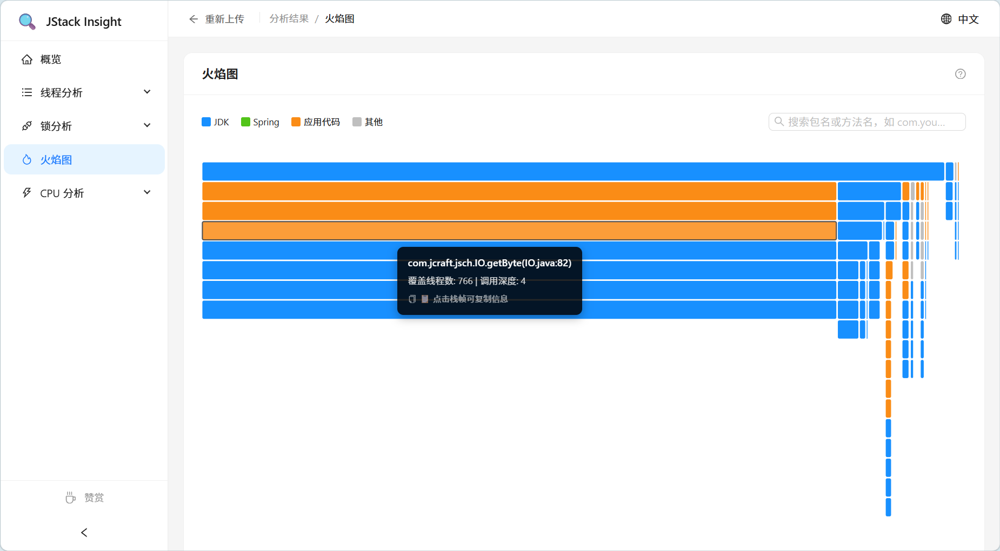
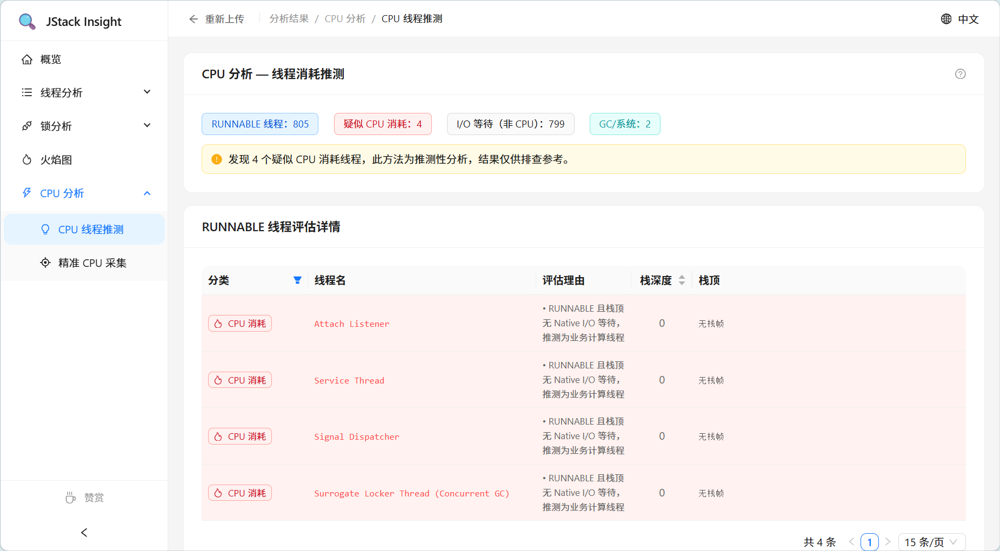
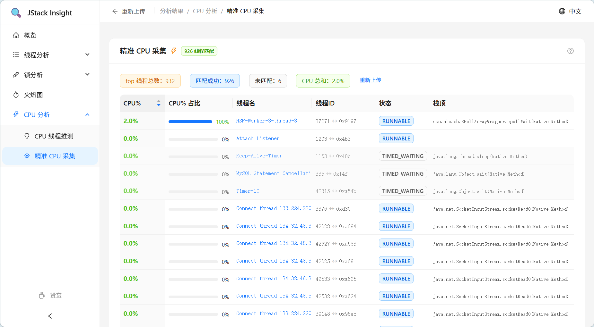

# JStack Insight

> Enterprise JVM Thread Dump (jstack) Visualization & Analysis Platform

[](https://adoptium.net)
[](https://spring.io/projects/spring-boot)
[](https://react.dev)
[](https://www.typescriptlang.org)

---

## Overview

**JStack Insight** is a jstack thread dump analysis tool for Java developers and SREs. Upload a `jstack` output file to get thread state distribution, lock contention graph, flame graph, deadlock detection, and CPU analysis. Results are persisted with a unique shareable link; each panel loads its data on demand.

Inspired by [fastthread.io](https://fastthread.io).

---

## Features

| Module | How It Works | Description |
|--------|-------------|-------------|
| **Thread Overview** | Iterates all threads, counts by `state`, renders pie chart + stat cards | At-a-glance thread state distribution |
| **Thread List** | Pagination + name/state search; expands via bucket index for lazy stack trace loading | Loads only what you need |
| **Thread Groups** | Auto-groups by name prefix (before first `-`), counts per-group states | Spot thread pool saturation |
| **Same Stack Analysis** | Server loads all threads, groups by `stackTrace.join('\0')`, returns ~50KB pre-grouped result | Find identical stack patterns (infinite loops / pool exhaustion) |
| **Lock Graph** | Parses `lockedMonitors` + `waitingOnLock` into directed graph, D3.js force-directed render | Visualize thread↔lock contention |
| **Deadlock Detection** | DFS three-color marking on thread dependency graph, detects Monitor + JUC lock cycles | Automatic circular deadlock identification |
| **Flame Graph** | Aggregates all stack traces into prefix tree, D3 Partition Ice Chart by width | Stack-frame-level CPU hotspot |
| **CPU Inference** | Heuristic classification by thread name keywords (GC/Cleaner/IO/JDBC) + state | Preliminary CPU analysis, no top file needed |
| **Precise CPU** | Upload `top -H` output, correlates by PID(decimal)↔nid(hex), returns exact CPU% | Thread-level CPU usage precision |
| **Report Sharing** | Persists analysis as bucketed JSON files, generates unique link; 24h default, extend to 48h | File-system based, no database |
| **i18n** | i18next framework, `zh-CN.ts` / `en.ts` standalone translation files | One-click switch |

---

## Tech Stack

### Backend

- **JDK 1.8**
- **Spring Boot 2.7.18**
- **Maven**
- **Lombok**, **Apache Commons Lang3**
- **SpringDoc OpenAPI 3** (Swagger UI)
- **Spring AOP** (upload audit aspect)

### Frontend

- **React 18** + **TypeScript 4.9**
- **Ant Design 5**
- **@ant-design/charts**
- **D3.js 7**
- **i18next**

---

## Project Structure

```
jstack-insight/
├── backend/
│   ├── pom.xml
│   └── src/main/
│       ├── resources/
│       │   ├── application.yml       # Port 9595, max upload 10MB
│       │   └── static/               # Built frontend assets
│       └── java/com/zeng/jstackinsight/
│           ├── controller/           # REST API
│           ├── service/
│           │   ├── parser/           # jstack FSM parser + top file parser
│           │   ├── analyzer/         # Deadlock, finalizer, exception detectors
│           │   ├── impl/             # Analysis service + report persistence
│           │   └── model/            # Parse result objects
│           ├── api/                  # VO classes
│           ├── aspect/               # Upload audit aspect + IP log filter
│           ├── converter/            # model → VO conversion
│           └── exception/            # Global exception handler
│
├── frontend/
│   ├── package.json                  # proxy -> localhost:9595
│   └── src/
│       ├── pages/
│       │   ├── upload/               # Upload page
│       │   └── result/               # Report page (by UUID lazy loading)
│       ├── types/                    # TypeScript types
│       ├── services/                 # Axios HTTP client
│       └── i18n/                     # EN/ZH translations
│
└── jstackInsightData/                # Runtime report storage (gitignored)
```

---

## Storage & Lazy Loading

### Storage Layout

Reports are stored per UUID. Thread details are batched into 50-thread chunks to balance file size and count:

```
jstackInsightData/reports/{yyyy-MM-dd}/{uuid}/
├── meta.json              # UUID, filename, expiry, thread count, deadlock flag (~200B)
├── threads-summary.json   # Thread summary sans stack traces (~200KB)
├── threads-idx.json       # tid → bucket index (~10KB)
├── threads/
│   ├── 0.json             # Full thread detail buckets, ~50 threads each (~100KB)
│   └── 1.json
├── lock-graph.json        # Lock graph (~50KB)
├── flame-graph.json       # Flame graph (~200KB)
└── deadlocks.json         # Deadlock chains (~5KB)
```

### On-Demand Loading

| Tab | Requests | Trigger |
|---|---|---|
| Overview | `summary`(~200B) + `threads-summary`(~200KB) | First open |
| Thread List | Above + `threads-idx`(~10KB) | First switch to tab |
| Expand row | `thread-bucket/{n}`(~100KB) | Click expand arrow |
| Same Stack | `stack-groups`(~50KB) | First switch to tab |
| Lock/Deadlock | `lock-graph` + `deadlocks` | First switch to tab |
| Flame Graph | `flame-graph` | First switch to tab |
| CPU Inference | Uses cached `threads-summary` | — |
| Precise CPU | `top-cpu-with-report/{uuid}` | After uploading top file |

Frontend caches the bucket index and loaded buckets in React state. Clicking multiple threads within the same bucket incurs zero additional requests.

### Expiry & Cleanup

- Default 24-hour expiry
- Click "Share": extends to 48h if less than 48h remaining; does nothing if already sufficient
- Cleanup thread runs every 30 minutes; expired reports deleted within 30 min
- Immediate cleanup on startup

---

## Quick Start

### Prerequisites

- **JDK 1.8+**
- **Node.js 16+** (with npm)
- **Maven 3.6+**

### Development

```bash
# 1. Start backend (port 9595)
cd backend
mvn spring-boot:run

# 2. Start frontend (port 3000, proxies to 9595)
cd frontend
npm install
npm start
```

Open http://localhost:3000.

### Production Build

```bash
# Build frontend
cd frontend
npm run build

# Package backend
cd backend
mvn clean package -DskipTests

# Run
java -jar target/jstack-insight-1.0.0-SNAPSHOT.jar
```

Visit http://localhost:9595/index.html

---

## API Reference

### Upload & Analyze

| Method | Path | Description |
|--------|------|-------------|
| POST | `/api/v1/analysis/upload` | Upload jstack file (.txt, ≤10MB), analyze & persist, returns UUID |
| POST | `/api/v1/analysis/top-cpu-with-report/{uuid}` | Upload top -H file for exact CPU correlation with an existing report |

### Report Lazy Loading

| Method | Path | Description | Payload |
|--------|------|-------------|---------|
| GET | `/api/v1/report/{uuid}/summary` | Report summary: filename, expiry, thread count, deadlock flag | ~200B |
| GET | `/api/v1/report/{uuid}/threads-summary` | All threads sans stack traces, for overview/list/CPU tabs | ~200KB |
| GET | `/api/v1/report/{uuid}/threads-idx` | tid → bucket index, frontend caches for on-demand bucket loading | ~10KB |
| GET | `/api/v1/report/{uuid}/thread-bucket/{n}` | Full thread details for bucket n (~50 threads, with stack traces) | ~100KB |
| GET | `/api/v1/report/{uuid}/stack-groups` | Pre-grouped same-stack results (sample frame + thread names) | ~50KB |
| GET | `/api/v1/report/{uuid}/lock-graph` | Lock contention directed graph (nodes + edges) | ~50KB |
| GET | `/api/v1/report/{uuid}/flame-graph` | Flame graph tree structure | ~200KB |
| GET | `/api/v1/report/{uuid}/deadlocks` | Deadlock detection results with chain details | ~5KB |
| POST | `/api/v1/report/{uuid}/extend` | Extend expiry to 48h, returns new expiration timestamp | - |

Full API docs: http://localhost:9595/swagger-ui/index.html

---

## Configuration

### Backend (`application.yml`)

```yaml
server:
  port: 9595

spring:
  servlet:
    multipart:
      max-file-size: 10MB
      max-request-size: 10MB

jstack-insight:
  report:
    dir: jstackInsightData/reports    # Storage directory
    expire-hours: 24                  # Default hours before expiry
    extend-hours: 48                  # Hours extended on share
```

Log config: `src/main/resources/logback-spring.xml` (console pattern includes client IP).

### Frontend

| Env Var | Description | Default |
|---------|-------------|---------|
| `REACT_APP_API_BASE_URL` | API base URL | `http://localhost:9595` |

---

## Security

- **Content Validation**: First 2KB checked for jstack signatures (`tid=0x`/`Full thread dump`/`java.lang.Thread.State`); malformed files rejected immediately
- **Audit Logging**: All uploads logged via AOP with client IP, filename, file size, duration, UUID
- **IP Tracking**: Real client IP extracted from `X-Forwarded-For`/`X-Real-IP` headers, injected into every log line
- **UUID**: `UUID.randomUUID()` (122 random bits), brute-force infeasible, zero collision risk

---

## Repository

[](https://github.com/haisome/jstack-insight)
[](https://gitee.com/Z-HaiSome/jstack-insight)

---

## References

Analysis patterns inspired by [fastthread.io](https://fastthread.io) blog:

| Topic | Link | Description |
|-------|------|-------------|
| **Deadlock Detection** | [Deadlock](https://blog.fastthread.io/deadlock/) | Monitor & JUC lock circular dependency detection |
| **Finalizer Trap** | [Leprechaun Trap](https://blog.fastthread.io/thread-dump-analysis-pattern-leprechaun-trap/) | Finalizer stuck in finalize() causing OOM |
| **Exception Threads** | [Throwing Exception](https://blog.fastthread.io/threads-throwing-exception/) | Detecting threads via Exception/Error constructors in stack |
| **RUNNABLE ≠ Running** | [Really Running](https://blog.fastthread.io/really-running/) | RUNNABLE threads may not actually consume CPU |
| **Repetitive Strain** | [RSI Pattern](https://blog.fastthread.io/thread-dump-analysis-pattern-repetitive-strain-injury-rsi/) | Many threads stuck on identical stack traces |

> 💡 Start with [Really Running](https://blog.fastthread.io/really-running/) to correct a common misconception, then explore each detection pattern.

---

## Screenshots

<details>
<summary>📸 Click to expand</summary>

### Overview


### Thread List


### Lock Graph


### Deadlock


### Flame Graph


### CPU Inference


### Precise CPU


</details>

---

## License

Licensed under [Apache License 2.0](LICENSE).

> ⚠️ Please read the [Disclaimer](DISCLAIMER.md) before use.
