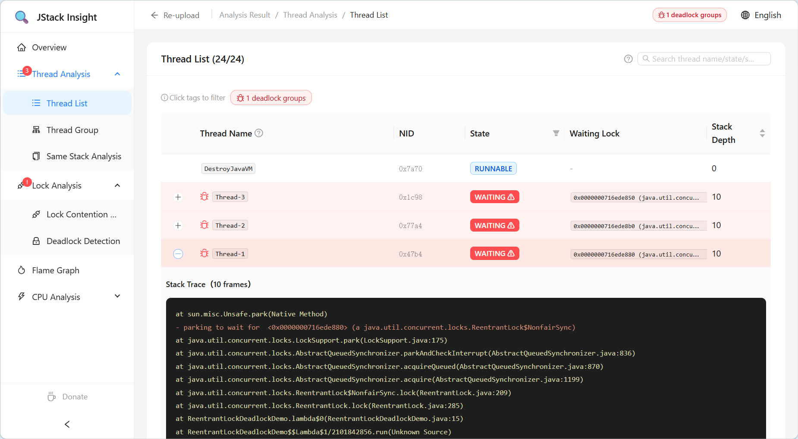
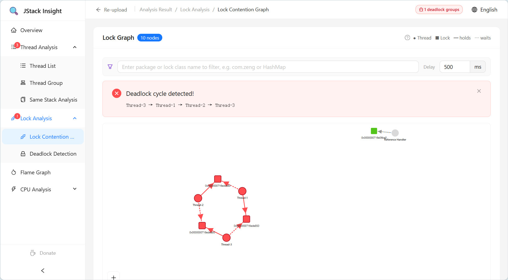
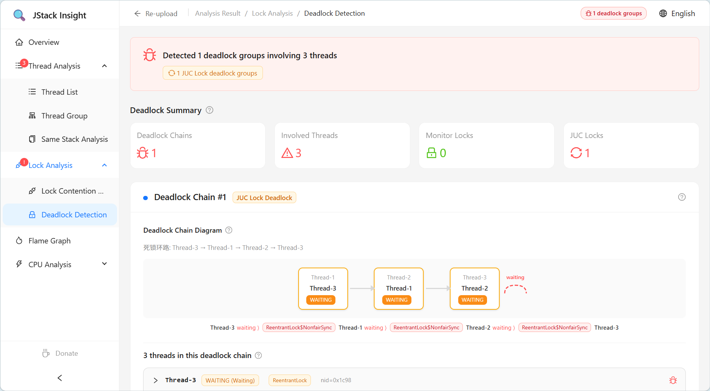
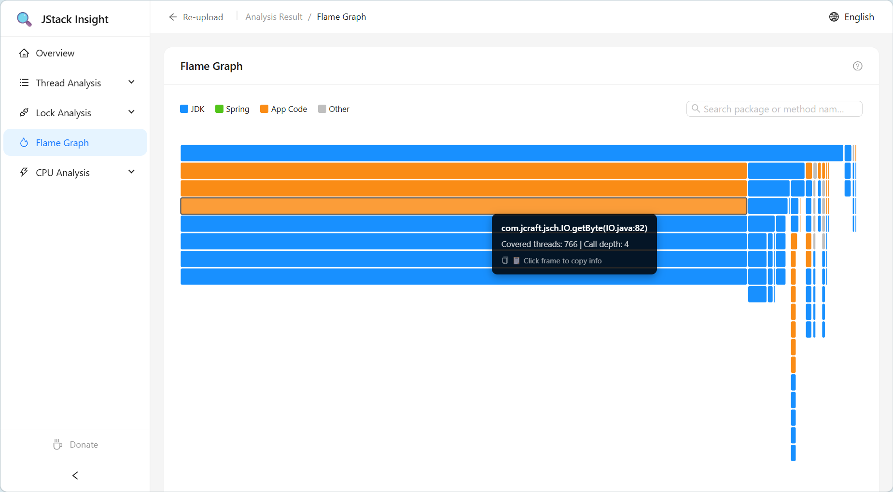
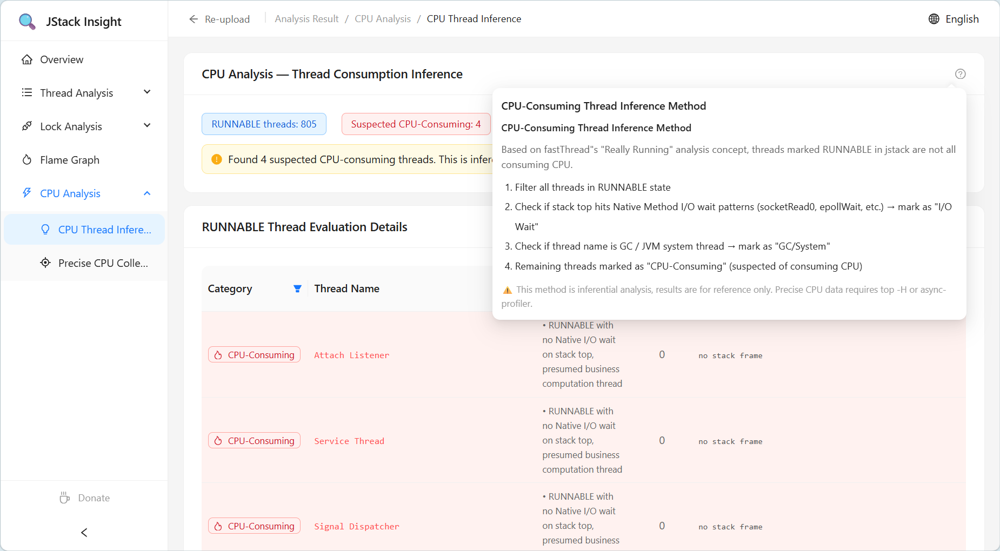
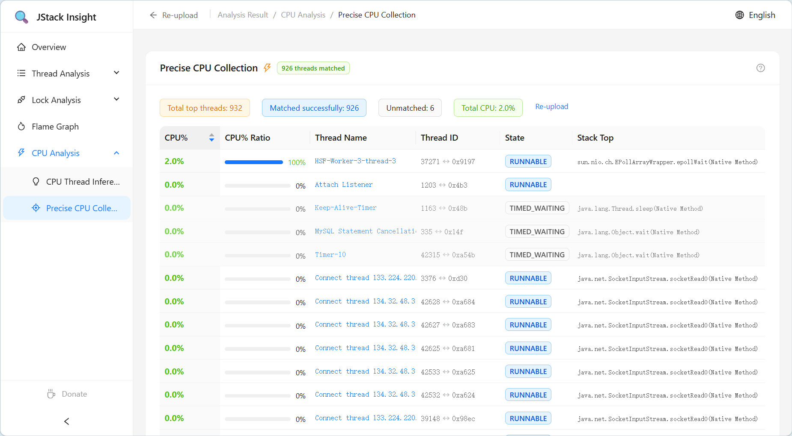

# JStack Insight

> Enterprise-grade JVM Thread Dump Visualization &amp; Analysis Platform

[](https://adoptium.net)
[](https://spring.io/projects/spring-boot)
[](https://react.dev)
[](https://www.typescriptlang.org)

---

## Overview

**JStack Insight** is a jstack thread dump analysis tool designed for Java developers and SREs. Upload a `jstack` output file and get multi-dimensional analysis including thread state distribution, lock contention graph, flame graph, and deadlock detection — all visualized to help you quickly pinpoint CPU spikes, thread deadlocks, and thread pool saturation in production.

Inspired by [fastthread.io](https://fastthread.io).

---

## Key Features

| Module | Description |
|--------|-------------|
| **Overview** | Pie charts + metric cards showing thread state distribution (RUNNABLE / BLOCKED / WAITING, etc.) |
| **Thread List** | Searchable and filterable table with expandable stack trace details |
| **Thread Groups** | Auto-group threads by name prefix with per-group state breakdown |
| **Identical Stack Trace** | Group threads by full stack trace to detect flooding (infinite loops / thread pool saturation) |
| **Lock Contention Graph** | D3.js force-directed graph showing thread &harr; lock hold/wait relationships |
| **Deadlock Detection** | DFS three-coloring algorithm detecting cycles for both Monitor locks and JUC locks |
| **Flame Graph** | D3 Partition Icicle Chart aggregating call stack hotspots |
| **CPU Analysis** | Heuristic CPU thread inference + precise CPU correlation via `top -H` upload |
| **i18n** | Built-in Chinese / English toggle |

---

## Tech Stack

### Backend

- **JDK 1.8**
- **Spring Boot 2.7.18**
- **Maven** build
- **Lombok**, **Apache Commons Lang3**
- **SpringDoc OpenAPI 3** (Swagger UI)

### Frontend

- **React 18** + **TypeScript 4.9**
- **Ant Design 5** component library
- **@ant-design/charts** for charts
- **D3.js 7** for force graph &amp; flame graph
- **i18next** for internationalization

---

## Project Structure

```
jstack-insight/
├── sample_jstack.txt                 # Sample jstack file
│
├── backend/                          # Spring Boot backend
│   ├── pom.xml
│   └── src/main/
│       ├── resources/
│       │   ├── application.yml       # Port 9595, upload limit 50MB
│       │   └── static/              # Frontend static files (production)
│       └── java/com/zeng/jstackinsight/
│           ├── controller/           # REST API
│           ├── service/
│           │   ├── parser/           # FSM-based hand-written jstack parser
│           │   └── analyzer/         # Deadlock detector + flame graph builder
│           ├── api/                  # DTO / VO
│           └── exception/           # Global exception handler
│
└── frontend/                         # React frontend
    ├── package.json                  # proxy -> localhost:9595
    ├── scripts/build-prod.js         # Build & copy to backend/static
    └── src/
        ├── pages/
        │   ├── upload/               # Upload page
        │   └── result/               # Result page (overview/threads/lock-graph/flame-graph/deadlock/cpu)
        ├── types/                    # TypeScript type definitions
        ├── services/                 # Axios HTTP client
        └── i18n/                     # i18n resources
```

---

## Quick Start

### Prerequisites

- **JDK 1.8+**
- **Node.js 16+** (with npm)
- **Maven 3.6+**

### Development Mode

```bash
# 1. Start backend (port 9595)
cd backend
mvn spring-boot:run

# 2. Start frontend (port 3000, auto-proxy to 9595)
cd frontend
npm install
npm start
```

Open http://localhost:3000 and upload `sample_jstack.txt` to try it out.

### Production Build

```bash
# Build frontend and copy to backend static directory
cd frontend
npm run build:prod

# Package backend
cd backend
mvn clean package -DskipTests

# Run
java -jar target/jstack-insight-1.0.0-SNAPSHOT.jar
```

Access http://localhost:9595/index.html

---

## API Endpoints

| Method | Path | Description |
|--------|------|-------------|
| POST | `/api/v1/analysis/upload` | Upload a jstack file for full analysis |
| POST | `/api/v1/analysis/top-cpu` | Upload jstack + top -H files for precise CPU analysis |
| GET | `/api/v1/analysis/health` | Health check |

The upload endpoint returns complete analysis data including thread states, lock graph, flame graph, deadlock chains, and CPU inference.

Swagger UI is available at http://localhost:9595/swagger-ui/index.html after startup.

---

## Configuration

### Backend (`application.yml`)

```yaml
server:
  port: 9595

spring:
  servlet:
    multipart:
      max-file-size: 50MB
      max-request-size: 50MB
```

### Frontend

| Environment Variable | Description | Default |
|---------------------|-------------|---------|
| `REACT_APP_API_BASE_URL` | API base URL | `http://localhost:9595` |

---

## Repository

[](https://github.com/haisome/jstack-insight)
[](https://gitee.com/Z-HaiSome/jstack-insight)

---

## Reference Resources

The thread detection and analysis patterns in this project are referenced from the [fastthread.io](https://fastthread.io) professional blog. Below are the core reference articles:

| Topic | Link | Description |
|-------|------|-------------|
| **Deadlock Detection** | [Deadlock](https://blog.fastthread.io/deadlock/) | Cycle detection for Monitor locks and JUC locks |
| **Circular Deadlock** | [Circular Deadlock](https://blog.fastthread.io/circular-deadlock/) | A→B→C→A cycle pattern identification and analysis |
| **Finalizer Trap** | [Leprechaun Trap](https://blog.fastthread.io/thread-dump-analysis-pattern-leprechaun-trap/) | Finalizer thread stuck in finalize() leading to OOM |
| **Exception Thread** | [Throwing Exception](https://blog.fastthread.io/threads-throwing-exception/) | Identifying exception threads via Exception/Error constructors in stack frames |
| **RUNNABLE ≠ Running** | [Really Running](https://blog.fastthread.io/really-running/) | RUNNABLE state does not mean actually consuming CPU; cross-validate with `top -H` |
| **Repetitive Strain Injury (RSI)** | [RSI Pattern](https://blog.fastthread.io/thread-dump-analysis-pattern-repetitive-strain-injury-rsi/) | Pattern recognition: many threads stuck at identical call stacks |

> 💡 **Suggested reading order**: Start with [Really Running](https://blog.fastthread.io/really-running/) to correct common misconceptions, then read each detection pattern article for deeper understanding.

---

## Screenshots

<details>
<summary>📸 Click to view screenshots</summary>

### Overview


### Thread List


### Lock Contention Graph


### Deadlock Detection


### Flame Graph


### CPU Inference


### Precise CPU Collection


</details>

---

## License

MIT License
